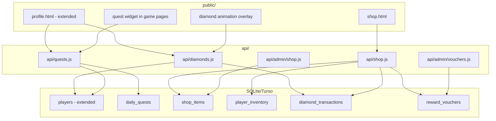

# Design: Hệ Thống Nhiệm Vụ Hằng Ngày, Kim Cương & Cửa Hàng

## Overview

Hệ thống gamification mở rộng cho Hoc Vui, bổ sung 4 module chính:

1. **Diamond Reward Engine** — Tính toán và phát kim cương dựa trên độ khó câu hỏi + combo multiplier
2. **Daily Quest System** — Sinh nhiệm vụ hàng ngày, theo dõi tiến trình, phát thưởng
3. **Streak & Level Tracker** — Đếm chuỗi ngày học liên tục, tính cấp độ player
4. **Shop & Inventory** — Mua vật phẩm ảo/thực, quản lý kho đồ, duyệt voucher

Hệ thống chạy trên stack hiện tại (Express + SQLite/Turso), không cần thêm framework hay build step. Mọi logic tính toán diamond/quest nằm ở server-side để tránh cheat.

## Architecture



### Key Design Decisions

1. **Server-side diamond calculation**: Tất cả logic tính diamond nằm ở backend để chống gian lận. Frontend chỉ hiển thị animation.
2. **Diamond award tại thời điểm answer**: Kim cương được cộng ngay khi player trả lời đúng (trong `POST /api/answers`), không đợi end-of-session.
3. **Quest tracking qua game_sessions**: Quest progress cập nhật khi session kết thúc (`POST /api/sessions`), vì "lượt chơi" = 1 session hoàn thành.
4. **Timezone Vietnam (UTC+7)**: Quest reset dùng server-side date tính theo UTC+7.
5. **Level dựa trên lifetime_diamonds**: Không dùng XP riêng, tránh phức tạp hóa — lifetime_diamonds là thước đo duy nhất.
6. **Stateless quest generation**: Quest mỗi ngày được generate deterministic dựa trên player_id + date seed, đảm bảo consistency khi gọi lại API.

## Components and Interfaces

### API Endpoints

#### Diamond System

| Method | Endpoint | Description |
|--------|----------|-------------|
| POST | `/api/answers` | (Modified) Tính diamond khi trả lời đúng, ghi diamond_transaction |
| GET | `/api/players/:id/diamonds` | Lấy balance + lifetime + transaction history |

Diamond calculation logic (embedded in answer processing):
```javascript
function calculateDiamonds(difficulty, comboStreak) {
  const base = { easy: 1, medium: 3, hard: 5 };
  let diamonds = base[difficulty] || 0;
  if (comboStreak >= 7) diamonds *= 3;
  else if (comboStreak >= 3) diamonds *= 2;
  return diamonds;
}
```

#### Daily Quests

| Method | Endpoint | Description |
|--------|----------|-------------|
| GET | `/api/players/:id/quests` | Lấy quests hôm nay (auto-generate nếu chưa có) |
| POST | `/api/players/:id/quests/check` | Cập nhật progress quest sau mỗi session |

#### Streak & Level

| Method | Endpoint | Description |
|--------|----------|-------------|
| GET | `/api/players/:id/streak` | Lấy streak hiện tại + milestone tiếp theo |
| POST | `/api/players/:id/streak/check` | Gọi khi quest completed, cập nhật streak |

#### Shop

| Method | Endpoint | Description |
|--------|----------|-------------|
| GET | `/api/shop/items` | Danh sách vật phẩm shop (filter by category, level) |
| POST | `/api/shop/buy` | Mua vật phẩm (trừ diamond, thêm inventory) |
| GET | `/api/players/:id/inventory` | Kho đồ player |
| PUT | `/api/players/:id/equip` | Trang bị avatar/frame |

#### Admin - Shop Management

| Method | Endpoint | Description |
|--------|----------|-------------|
| GET | `/api/admin/shop/items` | List all items (including inactive) |
| POST | `/api/admin/shop/items` | Tạo vật phẩm mới |
| PUT | `/api/admin/shop/items/:id` | Sửa vật phẩm |
| DELETE | `/api/admin/shop/items/:id` | Xóa vật phẩm |
| GET | `/api/admin/vouchers` | Danh sách voucher chờ duyệt |
| PUT | `/api/admin/vouchers/:id` | Duyệt/Từ chối voucher |
| GET | `/api/admin/diamond-stats` | Thống kê diamond economy |

### Frontend Pages

| File | Description |
|------|-------------|
| `public/shop.html` + `shop.js` + `shop.css` | Trang cửa hàng |
| `public/profile.html` (extended) | Profile mở rộng: avatar, streak, level, inventory, history |
| Quest widget | Component nhúng vào game pages hiển thị daily quests |
| Diamond animation | CSS animation "+X 💎" overlay cho mọi game page |

### Integration Points

1. **`POST /api/answers`** — Hook thêm diamond calculation + diamond_transaction insert
2. **`POST /api/sessions`** — Hook thêm quest progress check + streak update
3. **Game pages (v1-v12)** — Thêm quest widget + diamond animation overlay
4. **`public/home.html`** — Hiển thị streak badge + quick quest status
5. **Admin panel** — Thêm tab Shop Management + Voucher approval

## Data Models

### Extended `players` Table

```sql
ALTER TABLE players ADD COLUMN total_diamonds INTEGER DEFAULT 0;
ALTER TABLE players ADD COLUMN lifetime_diamonds INTEGER DEFAULT 0;
ALTER TABLE players ADD COLUMN current_streak INTEGER DEFAULT 0;
ALTER TABLE players ADD COLUMN longest_streak INTEGER DEFAULT 0;
ALTER TABLE players ADD COLUMN last_active_date TEXT DEFAULT NULL;
ALTER TABLE players ADD COLUMN equipped_avatar TEXT DEFAULT NULL;
ALTER TABLE players ADD COLUMN equipped_frame TEXT DEFAULT NULL;
```

### `daily_quests` Table

```sql
CREATE TABLE IF NOT EXISTS daily_quests (
  id INTEGER PRIMARY KEY AUTOINCREMENT,
  player_id INTEGER NOT NULL,
  quest_type TEXT NOT NULL,
  quest_description TEXT NOT NULL,
  target_value INTEGER NOT NULL,
  current_value INTEGER DEFAULT 0,
  diamond_reward INTEGER NOT NULL,
  is_completed INTEGER DEFAULT 0,
  quest_date TEXT NOT NULL,
  completed_at DATETIME DEFAULT NULL,
  FOREIGN KEY (player_id) REFERENCES players(id)
);

CREATE INDEX IF NOT EXISTS idx_daily_quests_player_date ON daily_quests(player_id, quest_date);
```

`quest_type` values: `play_any`, `play_mode`, `combo_streak`, `accuracy`, `learn_lesson`

### `shop_items` Table

```sql
CREATE TABLE IF NOT EXISTS shop_items (
  id INTEGER PRIMARY KEY AUTOINCREMENT,
  name TEXT NOT NULL,
  description TEXT DEFAULT '',
  category TEXT NOT NULL CHECK(category IN ('avatar', 'frame', 'sticker', 'powerup', 'voucher')),
  price_diamonds INTEGER NOT NULL,
  min_level TEXT DEFAULT 'bronze' CHECK(min_level IN ('bronze', 'silver', 'gold', 'diamond', 'master')),
  image_url TEXT DEFAULT NULL,
  is_active INTEGER DEFAULT 1,
  max_per_week INTEGER DEFAULT NULL,
  created_at DATETIME DEFAULT CURRENT_TIMESTAMP
);

CREATE INDEX IF NOT EXISTS idx_shop_items_category ON shop_items(category);
```

### `player_inventory` Table

```sql
CREATE TABLE IF NOT EXISTS player_inventory (
  id INTEGER PRIMARY KEY AUTOINCREMENT,
  player_id INTEGER NOT NULL,
  item_id INTEGER NOT NULL,
  purchased_at DATETIME DEFAULT CURRENT_TIMESTAMP,
  is_equipped INTEGER DEFAULT 0,
  FOREIGN KEY (player_id) REFERENCES players(id),
  FOREIGN KEY (item_id) REFERENCES shop_items(id)
);

CREATE INDEX IF NOT EXISTS idx_inventory_player ON player_inventory(player_id);
```

### `diamond_transactions` Table

```sql
CREATE TABLE IF NOT EXISTS diamond_transactions (
  id INTEGER PRIMARY KEY AUTOINCREMENT,
  player_id INTEGER NOT NULL,
  amount INTEGER NOT NULL,
  type TEXT NOT NULL CHECK(type IN ('earn', 'spend')),
  source TEXT NOT NULL CHECK(source IN ('answer', 'quest', 'streak', 'level_up', 'shop', 'all_quests_bonus')),
  reference_id INTEGER DEFAULT NULL,
  description TEXT DEFAULT '',
  created_at DATETIME DEFAULT CURRENT_TIMESTAMP,
  FOREIGN KEY (player_id) REFERENCES players(id)
);

CREATE INDEX IF NOT EXISTS idx_diamond_tx_player ON diamond_transactions(player_id);
CREATE INDEX IF NOT EXISTS idx_diamond_tx_created ON diamond_transactions(created_at);
```

### `reward_vouchers` Table

```sql
CREATE TABLE IF NOT EXISTS reward_vouchers (
  id INTEGER PRIMARY KEY AUTOINCREMENT,
  player_id INTEGER NOT NULL,
  item_id INTEGER NOT NULL,
  status TEXT NOT NULL DEFAULT 'pending' CHECK(status IN ('pending', 'approved', 'rejected')),
  requested_at DATETIME DEFAULT CURRENT_TIMESTAMP,
  resolved_at DATETIME DEFAULT NULL,
  admin_note TEXT DEFAULT NULL,
  FOREIGN KEY (player_id) REFERENCES players(id),
  FOREIGN KEY (item_id) REFERENCES shop_items(id)
);

CREATE INDEX IF NOT EXISTS idx_vouchers_status ON reward_vouchers(status);
CREATE INDEX IF NOT EXISTS idx_vouchers_player ON reward_vouchers(player_id);
```

### Level Thresholds (Constants)

```javascript
const PLAYER_LEVELS = [
  { name: 'bronze', label: 'Đồng', min: 0, max: 99 },
  { name: 'silver', label: 'Bạc', min: 100, max: 499 },
  { name: 'gold', label: 'Vàng', min: 500, max: 1499 },
  { name: 'diamond', label: 'Kim Cương', min: 1500, max: 4999 },
  { name: 'master', label: 'Bậc Thầy', min: 5000, max: Infinity },
];

const STREAK_MILESTONES = [
  { days: 3, bonus: 10 },
  { days: 7, bonus: 30 },
  { days: 14, bonus: 60 },
  { days: 30, bonus: 150 },
];
```

### Quest Generation Logic

Quests are generated server-side based on player_id + date as seed for determinism:

```javascript
const QUEST_TEMPLATES = [
  { type: 'play_any', desc: 'Chơi {n} lượt bất kỳ', targets: [2, 3, 4], rewards: [5, 8, 10] },
  { type: 'play_mode', desc: 'Chơi {n} lượt {mode}', targets: [1, 2], rewards: [8, 12] },
  { type: 'combo_streak', desc: 'Đạt combo {n} trong 1 ván', targets: [3, 5, 7], rewards: [10, 15, 20] },
  { type: 'accuracy', desc: 'Chơi {n} lượt đạt 80% đúng', targets: [1, 2], rewards: [10, 15] },
  { type: 'learn_lesson', desc: 'Học {n} bài mới', targets: [1], rewards: [10] },
];
```

Each day, 3-5 quests are selected pseudo-randomly per player. The seed ensures calling the API multiple times on the same day returns the same quests.


## Correctness Properties

*A property is a characteristic or behavior that should hold true across all valid executions of a system — essentially, a formal statement about what the system should do. Properties serve as the bridge between human-readable specifications and machine-verifiable correctness guarantees.*

### Property 1: Diamond base reward matches difficulty mapping

*For any* correct answer with a given difficulty and combo streak < 3, the diamond reward should be exactly: easy=1, medium=3, hard=5.

**Validates: Requirements 1.1, 1.2, 1.3**

### Property 2: Combo multiplier correctly applied

*For any* correct answer with combo streak in [3,6], diamonds = base × 2. *For any* correct answer with combo streak ≥ 7, diamonds = base × 3. The multiplier tiers are mutually exclusive and exhaustive.

**Validates: Requirements 1.4, 1.5**

### Property 3: Wrong answers never deduct diamonds

*For any* incorrect answer (regardless of difficulty or combo state), the player's diamond balance should not decrease.

**Validates: Requirements 1.6**

### Property 4: Diamond balance invariant

*For any* player, `total_diamonds` should equal the sum of all `earn` transactions minus the sum of all `spend` transactions in `diamond_transactions` for that player.

**Validates: Requirements 1.8**

### Property 5: Quest generation produces valid quests

*For any* player_id and date, generating daily quests should produce between 3 and 5 quests (inclusive), each quest must have a valid `quest_type` from the allowed set, and each quest's `diamond_reward` must be between 5 and 20 inclusive.

**Validates: Requirements 2.1, 2.2, 2.3**

### Property 6: All-quests-complete bonus

*For any* player who has all daily quests marked as completed for a given day, exactly one bonus transaction of 15 diamonds with source `all_quests_bonus` should exist for that player on that day.

**Validates: Requirements 2.5**

### Property 7: Quests are date-scoped

*For any* player querying quests on day D, the response should only contain quests where `quest_date` equals D. Quests from previous days should never be returned.

**Validates: Requirements 2.7**

### Property 8: Completed session increments quest progress

*For any* completed game session, if the player has an active `play_any` quest for today, the quest's `current_value` should increment by exactly 1.

**Validates: Requirements 2.8**

### Property 9: Streak increments on consecutive active days

*For any* player who completes at least 1 quest on day D and had `last_active_date` = D-1, their `current_streak` should increase by 1.

**Validates: Requirements 3.1**

### Property 10: Streak milestone awards correct bonus

*For any* streak value that exactly matches a milestone (3, 7, 14, or 30), the corresponding bonus (10, 30, 60, or 150 diamonds) should be awarded exactly once.

**Validates: Requirements 3.2, 3.3, 3.4, 3.5**

### Property 11: Streak resets on missed day

*For any* player whose `last_active_date` is more than 1 day before today, checking their streak should set `current_streak` to 0.

**Validates: Requirements 3.6**

### Property 12: Level assignment is deterministic from lifetime diamonds

*For any* `lifetime_diamonds` value, `getPlayerLevel()` should return exactly one level that satisfies: level.min ≤ lifetime_diamonds ≤ level.max. The level ranges must be non-overlapping and cover all non-negative integers.

**Validates: Requirements 4.1**

### Property 13: Purchase deducts diamonds and adds inventory

*For any* successful purchase, the player's `total_diamonds` decreases by exactly `price_diamonds`, and a new record appears in `player_inventory` with the correct `item_id` and `player_id`.

**Validates: Requirements 5.2**

### Property 14: Insufficient diamonds rejects purchase

*For any* player where `total_diamonds` < item's `price_diamonds`, a purchase attempt should fail (return error) and neither diamonds nor inventory should change.

**Validates: Requirements 5.3**

### Property 15: Voucher-category purchase creates pending voucher

*For any* purchase of an item with `category = 'voucher'`, a `reward_vouchers` record with `status = 'pending'` should be created for that player and item.

**Validates: Requirements 5.4**

### Property 16: Level gates shop purchases

*For any* player whose level rank is below an item's `min_level`, a purchase attempt should fail with an appropriate error.

**Validates: Requirements 4.3, 5.6**

### Property 17: New item flag based on creation date

*For any* shop item, it should be flagged as "new" if and only if `(current_date - created_at)` ≤ 7 days.

**Validates: Requirements 5.7**

### Property 18: Shop item CRUD round-trip

*For any* valid shop item data, creating it via the admin API and then retrieving it should return the same name, description, category, price, and min_level values.

**Validates: Requirements 6.1, 6.2**

### Property 19: Voucher status transitions are valid

*For any* voucher with `status = 'pending'`, admin can transition it to `approved` or `rejected`. *For any* voucher not in `pending` status, a status change attempt should fail.

**Validates: Requirements 6.4, 6.5**

### Property 20: Diamond economy stats are accurate

*For any* set of diamond transactions, the admin stats endpoint should return: total_earned = sum of all earn amounts, total_spent = sum of all spend amounts.

**Validates: Requirements 6.6**

### Property 21: Only owned items can be equipped

*For any* equip request where the player does not own the item (no record in `player_inventory`), the request should fail. *For any* equip request for an owned item, `equipped_avatar` or `equipped_frame` should update accordingly.

**Validates: Requirements 7.4**

### Property 22: Level-up awards bonus

*For any* diamond earn event that causes a player's level to change (based on new lifetime_diamonds crossing a threshold), a level-up bonus transaction should be created.

**Validates: Requirements 4.2**

## Error Handling

### API Error Responses

All error responses follow the existing pattern: `{ error: "message" }` with appropriate HTTP status codes.

| Scenario | Status | Error Message |
|----------|--------|---------------|
| Player not found | 404 | `Không tìm thấy người chơi` |
| Insufficient diamonds | 400 | `Không đủ kim cương` |
| Item not found / inactive | 404 | `Vật phẩm không tồn tại` |
| Level too low for item | 403 | `Cần đạt cấp {level} để mua` |
| Item max per week exceeded | 400 | `Đã đạt giới hạn tuần` |
| Voucher not in pending state | 400 | `Phiếu thưởng không ở trạng thái chờ` |
| Invalid quest type | 400 | `Loại nhiệm vụ không hợp lệ` |
| Missing required fields | 400 | `Thiếu thông tin bắt buộc` |

### Transactional Safety

- **Purchase operations**: Diamond deduction + inventory insert + transaction log must be atomic. Use SQLite transaction (via `db.batch()` or explicit transaction) to prevent partial state.
- **Quest completion + bonus**: When completing the last quest, both the quest update and the all-quests bonus must succeed together.
- **Streak update + milestone bonus**: Same atomic guarantee.

### Edge Cases

- Player with 0 diamonds trying to buy a free item (price=0): Should succeed
- Quest generation on the exact UTC+7 boundary (23:59 → 00:00): Use server-side Vietnam time consistently
- Player completing a session that satisfies multiple quest types: All applicable quests should progress
- Buying the same non-voucher item multiple times: Allowed (player can own multiple stickers, etc.)
- Equipping an item while another of the same type is equipped: Previous item gets unequipped automatically

## Testing Strategy

### Property-Based Testing

Library: **fast-check** (JavaScript property-based testing library)

Each correctness property from the design will be implemented as a single property-based test with minimum 100 iterations. Tests will be tagged with:

```
// Feature: daily-quest-reward-shop, Property {N}: {title}
```

Key areas for property testing:
- `calculateDiamonds(difficulty, comboStreak)` — pure function, ideal for PBT
- `getPlayerLevel(lifetimeDiamonds)` — pure function mapping
- `generateDailyQuests(playerId, date)` — deterministic generation
- `checkStreakMilestone(newStreak)` — pure milestone lookup
- Purchase validation logic (sufficient diamonds, level check)
- Diamond balance invariant (sum of transactions = balance)

### Unit Testing

Library: **vitest** (already used in existing test files)

Unit tests focus on:
- Specific examples: buying an item at exact price boundary
- Edge cases: streak reset after exactly 1 missed day, quest completion at day boundary
- Integration: session save triggers quest progress update
- API contract: correct HTTP status codes and response shapes
- Admin operations: CRUD lifecycle for shop items
- Voucher workflow: pending → approved/rejected transitions

### Test File Structure

```
tests/
  diamond-calc.property.test.js    — Properties 1-4
  quest-generation.property.test.js — Properties 5-8
  streak-level.property.test.js    — Properties 9-12, 22
  shop-purchase.property.test.js   — Properties 13-19
  inventory-equip.property.test.js — Properties 20-21
  diamond-system.unit.test.js      — Unit tests for diamond logic
  quest-system.unit.test.js        — Unit tests for quest system
  shop-system.unit.test.js         — Unit tests for shop/voucher
```

### Test Configuration

```javascript
// vitest.config.js addition
export default {
  test: {
    include: ['tests/**/*.test.js'],
  }
};
```

Property tests run with `fc.assert(fc.property(...), { numRuns: 100 })` minimum. For critical financial properties (diamond balance invariant, purchase deduction), use `numRuns: 200`.
