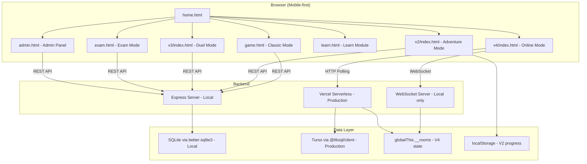
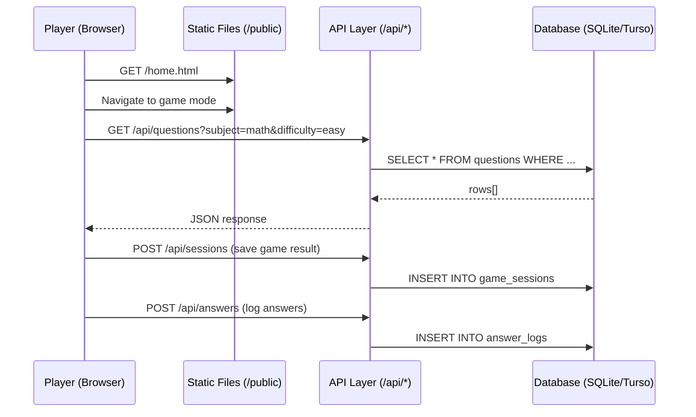
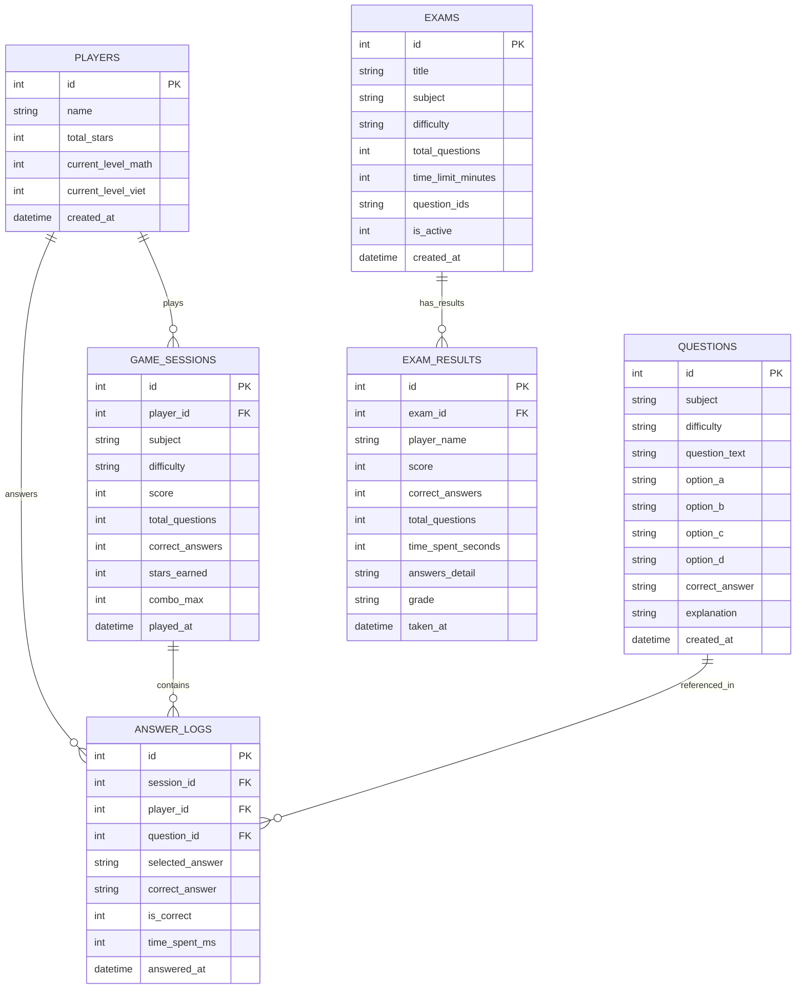

# Design Document: Học Vui Educational Game Platform

## Overview

Học Vui is a web-based educational game platform targeting a 7-year-old Vietnamese student transitioning from grade 1 to grade 2. The platform gamifies Math and Vietnamese language learning through a Plants vs Zombies metaphor across 4 game modes (Classic, Adventure, Duel, Online), an interactive Learn module, exam testing, and a parent-facing admin panel.

The system is built with vanilla HTML/CSS/JS on the frontend and a dual-mode backend (Express locally, Vercel serverless in production). Each game mode is a standalone HTML/JS bundle served as static files. Real-time multiplayer uses WebSocket locally and HTTP polling on Vercel. Data persistence uses SQLite (local) or Turso (production) through a unified database wrapper.

### Key Design Decisions

1. **No SPA framework** — Each game mode is a separate HTML file with its own JS bundle. This keeps bundles small, avoids framework overhead, and simplifies deployment as static files.
2. **Dual-mode database wrapper** — A single `db/database.js` module wraps `better-sqlite3` for local dev and `@libsql/client` for Turso in production, exposing the same `execute()` / `batch()` interface.
3. **Client-side question generation** — The algorithmic question generator runs in `admin.js` in the browser. No server compute needed for generation; only final saving hits the API.
4. **In-memory room state for V4** — Room data lives in `globalThis.__rooms` (Map). Acceptable for demo/family use; resets on Vercel cold starts.
5. **Web Audio API for sound** — No audio file assets needed. Sounds are synthesized programmatically.
6. **localStorage for V2 progress** — Adventure mode progress (unlocked levels, stars, coins) persists client-side without requiring login.

## Architecture

### High-Level Architecture Diagram



### Request Flow



### Deployment Topology

| Environment | Server | Database | V4 Multiplayer | Config |
|---|---|---|---|---|
| Local | Express + HTTP server | SQLite (better-sqlite3) | WebSocket | `node server.js` |
| Production | Vercel Serverless Functions | Turso (@libsql/client) | HTTP Polling | `vercel.json` routes |

## Components and Interfaces

### Frontend Components

| Component | File(s) | Responsibility |
|---|---|---|
| Home Page | `public/home.html`, `public/style.css` | Game mode selector, navigation |
| Classic Mode (V1) | `public/game.html`, `public/game.js` | Single-player quiz-shooting game |
| Adventure Mode (V2) | `public/v2/index.html`, `public/v2/game.js`, `public/v2/style.css` | 50-level world map, power-ups, daily quests |
| Duel Mode (V3) | `public/v3/index.html`, `public/v3/game.js`, `public/v3/style.css` | Same-device split-screen competition |
| Online Mode (V4) | `public/v4/index.html`, `public/v4/game.js`, `public/v4/style.css` | Remote multiplayer via room codes |
| Learn Module | `public/learn.html`, `public/learn.js`, `public/learn.css` | Interactive lessons with SVG clock |
| Exam Mode | `public/exam.html`, `public/exam.js`, `public/exam.css` | Timed tests with grading |
| Admin Panel | `public/admin.html`, `public/admin.js`, `public/admin.css` | Question/exam/player management |

### API Endpoints

| Endpoint | Method | Auth | Purpose |
|---|---|---|---|
| `/api/questions` | GET | No | Fetch questions by subject/difficulty |
| `/api/sessions` | POST | No | Save game session results |
| `/api/answers` | POST | No | Log individual answers |
| `/api/players` | GET/POST | No | Player CRUD |
| `/api/exams` | GET/POST | No | Exam listing and submission |
| `/api/room` | GET/POST | No | V4 room create/join/poll/answer |
| `/api/admin` | ALL | Basic Auth | Admin CRUD for questions, exams, players, analytics |

### Backend Services

| Service | File | Interface |
|---|---|---|
| Database Wrapper | `db/database.js` | `getDb()` → `{ execute(query), batch(stmts), executeMultiple(sql) }` |
| DB (Vercel) | `api/db.js` | `getDb()` → `@libsql/client` instance |
| WebSocket Server | `ws-server.js` | `setupWebSocket(httpServer)` — handles room lifecycle via messages |
| Room Polling API | `api/room.js` | Stateless HTTP handler using `globalThis.__rooms` Map |
| Admin API | `api/admin/index.js` | Query-param routed handler (`?resource=questions&action=batch`) |
| Seed Scripts | `db/seed.js`, `db/seed-turso.js` | Populate question bank from `db/questions/*.js` |

### Key Interfaces

```typescript
// Database wrapper interface (both local and production)
interface DbClient {
  execute(query: string | { sql: string; args?: any[] }): Promise<{ rows: any[]; rowsAffected?: number; lastInsertRowid?: number }>;
  batch(statements: Array<string | { sql: string; args?: any[] }>): Promise<Array<{ rows: any[] }>>;
  executeMultiple?(sql: string): Promise<void>;
}

// Question record
interface Question {
  id: number;
  subject: 'math' | 'vietnamese';
  difficulty: 'easy' | 'medium' | 'hard';
  question_text: string;
  option_a: string;
  option_b: string;
  option_c: string;
  option_d: string;
  correct_answer: 'a' | 'b' | 'c' | 'd';
  explanation?: string;
  created_at: string;
}

// V4 Room state (in-memory)
interface RoomState {
  host: string;
  guest: string | null;
  settings: { subject: string; difficulty: string; rounds: number; speed: string };
  state: 'waiting' | 'playing' | 'finished';
  questions: Question[];
  currentRound: number;
  roundStart: number;
  hostAnswer: { answer: string; time: number } | null;
  guestAnswer: { answer: string; time: number } | null;
  hostScore: number;
  guestScore: number;
  hostCorrect: number;
  guestCorrect: number;
  roundResult: object | null;
  matchResult: object | null;
  lastUpdate: number;
}

// Game session record
interface GameSession {
  id: number;
  player_id: number;
  subject: string;
  difficulty: string;
  score: number;
  total_questions: number;
  correct_answers: number;
  stars_earned: number;
  combo_max: number;
  played_at: string;
}

// Answer log record
interface AnswerLog {
  id: number;
  session_id: number;
  player_id: number;
  question_id: number;
  selected_answer: string;
  correct_answer: string;
  is_correct: 0 | 1;
  time_spent_ms: number;
  answered_at: string;
}

// Exam record
interface Exam {
  id: number;
  title: string;
  subject: 'math' | 'vietnamese' | 'mix';
  difficulty: 'easy' | 'medium' | 'hard' | 'mix';
  total_questions: number;
  time_limit_minutes: number;
  question_ids: string; // JSON array of IDs
  is_active: 0 | 1;
  created_at: string;
}

// Exam result record
interface ExamResult {
  id: number;
  exam_id: number;
  player_name: string;
  score: number;
  correct_answers: number;
  total_questions: number;
  time_spent_seconds: number;
  answers_detail: string; // JSON array
  grade: string; // A+, A, B, C, D, F
  taken_at: string;
}
```

## Data Models

### Entity Relationship Diagram



### Client-Side Data (localStorage)

Adventure Mode (V2) persists state in localStorage:

```javascript
// Key: 'hocvui_adventure'
{
  unlockedLevels: [1, 2, 3, ...],     // Level IDs unlocked
  stars: { 1: 3, 2: 2, 3: 1, ... },   // Stars earned per level
  coins: 150,                           // Currency balance
  plants: ['peashooter', 'sunflower'], // Unlocked plants
  dailyQuest: { date: '2024-01-15', completed: false, type: 'win3' },
  powerUps: { eliminate: 3, freeze: 2, double: 1 }
}
```

### In-Memory Data (V4 Online Mode)

Room state stored in `globalThis.__rooms` (Map<string, RoomState>):
- Created on room creation, deleted on disconnect or match end
- Keyed by 4-character alphanumeric room code
- Polled by clients every ~1 second (production) or pushed via WebSocket (local)

### Database Indexes

| Index | Table | Columns | Purpose |
|---|---|---|---|
| `idx_questions_subject_difficulty` | questions | subject, difficulty | Fast question lookup by category |
| `idx_sessions_player` | game_sessions | player_id | Player session history |
| `idx_answer_logs_player` | answer_logs | player_id | Player answer analytics |
| `idx_answer_logs_question` | answer_logs | question_id | Question difficulty analysis |
| `idx_answer_logs_session` | answer_logs | session_id | Session detail retrieval |
| `idx_exam_results_exam` | exam_results | exam_id | Exam result lookup |
| `idx_exam_results_player` | exam_results | player_name | Player exam history |

