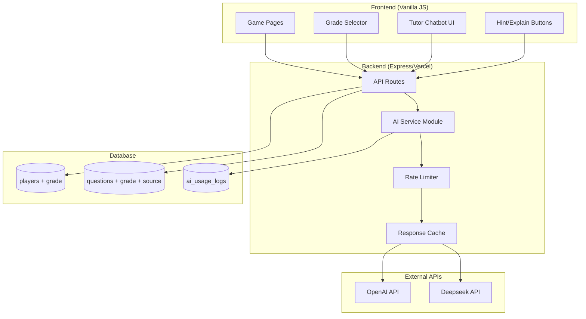
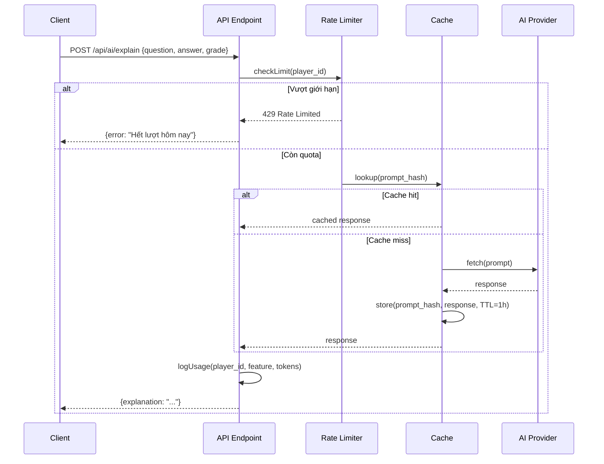

# Thiết Kế: Hỗ Trợ Đa Khối Lớp & Tích Hợp AI

## Tổng Quan (Overview)

Thiết kế này mở rộng hệ thống Học Vui để hỗ trợ đa khối lớp (2-5) và tích hợp AI (OpenAI/Deepseek) cho các tính năng: tạo câu hỏi động, giải thích đáp án, gợi ý, và chatbot gia sư. Kiến trúc đảm bảo AI là tính năng bổ sung — hệ thống hoạt động bình thường khi không có AI (graceful degradation).

### Nguyên tắc thiết kế
- AI là optional: Tất cả game modes hoạt động không phụ thuộc AI
- Server-side only: API key không bao giờ gửi xuống client
- Cost-aware: Rate limiting + caching để kiểm soát chi phí
- Child-safe: System prompt tiếng Việt, phù hợp tiểu học, có content filter
- Extensible: Thêm khối lớp mới chỉ cần thêm data, không đổi code

## Kiến Trúc (Architecture)



### Luồng xử lý AI Request



## Thành Phần & Giao Diện (Components and Interfaces)

### 1. `lib/ai-service.js` — AI Service Module

Module trung tâm quản lý mọi tương tác với AI providers.

```javascript
// lib/ai-service.js
export const AI_CONFIG = {
  provider: process.env.AI_PROVIDER || 'openai',
  model: process.env.AI_MODEL || null, // auto-detect based on provider
  dailyLimit: parseInt(process.env.AI_DAILY_LIMIT || '50'),
  apiKey: null, // resolved at runtime
};

// Public API
export function isAIEnabled() → boolean
export async function generateExplanation(question, selectedAnswer, correctAnswer, grade) → string
export async function generateHint(question, grade, level) → string
export async function generateQuestions(subject, difficulty, grade, quantity) → Question[]
export async function chatWithTutor(messages, lessonContext, grade) → string
```

**Provider Abstraction:**
```javascript
// Internal: provider routing
function getProviderConfig() {
  if (AI_CONFIG.provider === 'deepseek') {
    return {
      baseUrl: 'https://api.deepseek.com/v1',
      model: AI_CONFIG.model || 'deepseek-chat',
      apiKey: process.env.DEEPSEEK_API_KEY,
    };
  }
  return {
    baseUrl: 'https://api.openai.com/v1',
    model: AI_CONFIG.model || 'gpt-4o-mini',
    apiKey: process.env.OPENAI_API_KEY,
  };
}

// Internal: unified fetch call
async function callAI(messages, options = {}) → { content, tokens_used }
```

### 2. `lib/ai-rate-limiter.js` — Rate Limiter

```javascript
// In-memory Map cho local dev, query DB cho production
export function checkRateLimit(playerId) → { allowed: boolean, remaining: number, resetAt: string }
export function recordUsage(playerId, feature, tokensUsed) → void
```

**Chiến lược:**
- Local dev: In-memory Map với key `playerId:date` → count
- Production: Query `ai_usage_logs` table, COUNT(*) WHERE player_id = ? AND date = today

### 3. `lib/ai-cache.js` — Response Cache

```javascript
// In-memory Map với TTL 1 giờ
const cache = new Map(); // key: hash(prompt) → { response, expiresAt }

export function getCached(promptHash) → string | null
export function setCache(promptHash, response, ttlMs = 3600000) → void
export function clearExpired() → void
```

### 4. API Endpoints Mới

| Endpoint | Method | Mô tả |
|----------|--------|--------|
| `/api/ai/explain` | POST | Giải thích đáp án |
| `/api/ai/hint` | POST | Gợi ý cho câu hỏi |
| `/api/ai/chat` | POST | Chat với gia sư AI |
| `/api/ai/generate` | POST | Tạo câu hỏi (Admin) |
| `/api/ai/status` | GET | Kiểm tra AI có hoạt động |

**Request/Response format:**

```javascript
// POST /api/ai/explain
Request:  { player_id, question_text, options: {a,b,c,d}, selected_answer, correct_answer, grade }
Response: { explanation: "Câu trả lời đúng là B vì..." }

// POST /api/ai/hint
Request:  { player_id, question_text, options: {a,b,c,d}, grade, hint_level: 1|2 }
Response: { hint: "Hãy nghĩ về..." }

// POST /api/ai/chat
Request:  { player_id, messages: [{role,content}], lesson_context, grade }
Response: { reply: "...", messages_remaining: 18 }

// POST /api/ai/generate (Admin only)
Request:  { subject, difficulty, grade, quantity }
Response: { questions: [...] }

// GET /api/ai/status
Response: { enabled: true, provider: "openai", model: "gpt-4o-mini" }
```

### 5. Grade Selector UI Component

Hiển thị trong profile gate (lần đầu) và trang Profile (đổi lớp).

```html
<!-- Grade selector embedded in profile gate -->
<div class="grade-selector">
  <label>Lớp của con:</label>
  <div class="grade-options">
    <button data-grade="2" class="grade-btn active">📚 Lớp 2</button>
    <button data-grade="3" class="grade-btn">📖 Lớp 3</button>
    <button data-grade="4" class="grade-btn">📘 Lớp 4</button>
    <button data-grade="5" class="grade-btn">📗 Lớp 5</button>
  </div>
</div>
```

### 6. Frontend AI Integration Pattern

Mỗi game page kiểm tra AI status lúc init, và conditionally hiện nút AI:

```javascript
// Pattern chung cho tất cả game pages
let aiEnabled = false;

async function checkAIStatus() {
  try {
    const res = await fetch('/api/ai/status');
    const data = await res.json();
    aiEnabled = data.enabled;
  } catch { aiEnabled = false; }

  // Show/hide AI buttons based on status
  document.querySelectorAll('.ai-feature').forEach(el => {
    el.style.display = aiEnabled ? '' : 'none';
  });
}
```

## Mô Hình Dữ Liệu (Data Models)

### Schema Changes

```sql
-- Migration: Thêm grade vào players
ALTER TABLE players ADD COLUMN grade INTEGER DEFAULT 2;

-- Migration: Thêm grade và source vào questions
ALTER TABLE questions ADD COLUMN grade INTEGER DEFAULT 2;
ALTER TABLE questions ADD COLUMN source TEXT DEFAULT 'manual';

-- New table: AI Usage Logs
CREATE TABLE IF NOT EXISTS ai_usage_logs (
  id INTEGER PRIMARY KEY AUTOINCREMENT,
  player_id INTEGER NOT NULL,
  feature TEXT NOT NULL CHECK(feature IN ('explain', 'hint', 'chat', 'generate')),
  tokens_used INTEGER DEFAULT 0,
  prompt_hash TEXT DEFAULT NULL,
  created_at DATETIME DEFAULT CURRENT_TIMESTAMP,
  FOREIGN KEY (player_id) REFERENCES players(id)
);

CREATE INDEX IF NOT EXISTS idx_ai_usage_player_date ON ai_usage_logs(player_id, created_at);
CREATE INDEX IF NOT EXISTS idx_questions_grade ON questions(subject, difficulty, grade);
```

### Updated Questions Query

```javascript
// Trước: SELECT * FROM questions WHERE subject = ? AND difficulty = ? ORDER BY RANDOM() LIMIT ?
// Sau:
const result = await db.execute({
  sql: `SELECT * FROM questions WHERE subject = ? AND difficulty = ? AND grade = ? ORDER BY RANDOM() LIMIT ?`,
  args: [subject, difficulty, grade, parseInt(limit)],
});
```

### AI Generated Question Format

```javascript
{
  subject: 'math',
  difficulty: 'easy',
  grade: 3,
  question_text: '45 + 27 = ?',
  option_a: '72',
  option_b: '62',
  option_c: '82',
  option_d: '71',
  correct_answer: 'a',
  explanation: 'Ta cộng hàng đơn vị: 5+7=12, viết 2 nhớ 1. Hàng chục: 4+2+1=7. Vậy 45+27=72',
  source: 'ai'
}
```

### System Prompts

```javascript
const SYSTEM_PROMPTS = {
  explain: (grade) => `Bạn là giáo viên tiểu học Việt Nam dạy lớp ${grade}. 
Giải thích ngắn gọn (tối đa 3 câu) tại sao đáp án đúng, dùng ngôn ngữ dễ hiểu cho trẻ ${grade + 5} tuổi.
Dùng ví dụ cụ thể nếu có thể.`,

  hint: (grade, level) => `Bạn là giáo viên tiểu học Việt Nam dạy lớp ${grade}.
${level === 1 
  ? 'Cho gợi ý hướng suy nghĩ (1 câu ngắn). KHÔNG tiết lộ đáp án.'
  : 'Cho gợi ý cụ thể hơn (1-2 câu) giúp học sinh tìm ra đáp án. KHÔNG nói thẳng đáp án.'}`,

  chat: (grade, context) => `Bạn là gia sư AI cho học sinh lớp ${grade} Việt Nam.
Trả lời ngắn gọn (tối đa 4-5 câu), dễ hiểu.
CHỈ trả lời câu hỏi liên quan đến học tập.
Nếu câu hỏi không liên quan học tập, nhắc nhở: "Hỏi bài thôi nhé! 📚"
${context ? `Ngữ cảnh bài học hiện tại: ${context}` : ''}`,

  generate: (subject, difficulty, grade) => `Tạo câu hỏi trắc nghiệm ${subject === 'math' ? 'Toán' : subject === 'vietnamese' ? 'Tiếng Việt' : 'Tiếng Anh'} lớp ${grade}, độ khó ${difficulty}.
Theo chương trình giáo dục Việt Nam.
Trả về JSON array với format:
[{"question_text":"...","option_a":"...","option_b":"...","option_c":"...","option_d":"...","correct_answer":"a|b|c|d","explanation":"..."}]`
};
```


## Correctness Properties

*Một property là đặc tính hoặc hành vi phải luôn đúng trong mọi trường hợp thực thi hợp lệ của hệ thống — về cơ bản là một phát biểu hình thức về những gì hệ thống phải làm. Properties là cầu nối giữa đặc tả dạng ngôn ngữ tự nhiên và đảm bảo tính đúng đắn có thể kiểm chứng bằng máy.*

### Property 1: Grade persistence round-trip

*For any* valid grade value (2, 3, 4, 5) and any player, setting that player's grade and then querying the player should return the same grade value.

**Validates: Requirements 1.2, 1.3**

### Property 2: Question filtering by grade

*For any* player with grade G, and any query for questions with subject S and difficulty D, all returned questions must have `grade = G`. If no grade param is explicitly passed, the system uses the player's stored grade.

**Validates: Requirements 2.2, 2.5**

### Property 3: AI enabled only with valid API key

*For any* configuration state, `isAIEnabled()` returns `true` if and only if at least one valid API key environment variable is set (OPENAI_API_KEY or DEEPSEEK_API_KEY). When disabled, all AI endpoint calls return appropriate error/disabled status.

**Validates: Requirements 3.3, 10.2, 6.6, 7.8**

### Property 4: Provider routing by configuration

*For any* value of `AI_PROVIDER` environment variable, the system routes API calls to the correct provider endpoint: `openai` → OpenAI API, `deepseek` → Deepseek API, with the corresponding API key and model defaults.

**Validates: Requirements 3.4, 10.1**

### Property 5: Rate limiting enforcement

*For any* player who has made N requests today where N >= daily limit (configurable via `AI_DAILY_LIMIT`, default 50), the next AI request must be rejected with `allowed: false` and a friendly message. The limit applies across all AI features combined.

**Validates: Requirements 3.5, 9.1, 9.4, 9.5**

### Property 6: Cache hit avoids API call

*For any* prompt that has been previously called and cached (within TTL of 1 hour), calling with the same prompt hash should return the cached response without making a new API call to the external provider.

**Validates: Requirements 3.6, 9.6**

### Property 7: No sensitive data in API responses

*For any* API response from any endpoint, the response body must not contain API keys, auth tokens, or any value from `OPENAI_API_KEY`, `DEEPSEEK_API_KEY`, or `TURSO_AUTH_TOKEN`.

**Validates: Requirements 3.7**

### Property 8: AI-generated questions conform to schema

*For any* response from the question generator, each question object must have all required fields (`question_text`, `option_a`, `option_b`, `option_c`, `option_d`, `correct_answer`, `explanation`), and `correct_answer` must be one of `'a'`, `'b'`, `'c'`, `'d'`.

**Validates: Requirements 4.2**

### Property 9: Retry on malformed AI response

*For any* AI response that fails schema validation, the system must retry up to 2 additional times. If all 3 attempts fail, it returns an error. Total calls to AI provider for a single request ≤ 3.

**Validates: Requirements 4.4**

### Property 10: AI-generated questions saved with source='ai'

*For any* question generated by AI and persisted to the database, querying that question must show `source = 'ai'`.

**Validates: Requirements 4.6**

### Property 11: Fallback to static explanation when AI unavailable

*For any* question that has a non-null `explanation` field in the database, when AI_Service is unavailable (disabled or error), the explain endpoint returns that static explanation as fallback.

**Validates: Requirements 5.5, 10.3**

### Property 12: Hint does not reveal answer

*For any* hint response generated for a question, the hint text must not contain the exact text of the correct answer option.

**Validates: Requirements 6.2**

### Property 13: Maximum 2 hints per question per player

*For any* player and any question, requesting a 3rd hint must be rejected. The system tracks hint usage per (player, question) pair and enforces the limit.

**Validates: Requirements 6.4**

### Property 14: Diamond penalty when hint used

*For any* correct answer where the player has used at least one hint on that question, the diamond reward must be exactly 50% of the normal reward (rounded down).

**Validates: Requirements 6.5**

### Property 15: Chat message daily limit

*For any* player who has sent 20 chat messages today, the next chat request must be rejected with a friendly message indicating the daily limit has been reached.

**Validates: Requirements 7.6**

### Property 16: Chat history accumulates within session

*For any* sequence of N chat messages sent within a single session, the messages array passed to AI must contain all N previous messages in order (session-scoped, client-managed).

**Validates: Requirements 7.5**

### Property 17: AI usage logging

*For any* successful AI call (explain, hint, chat, generate), a log entry must be created in `ai_usage_logs` with the correct `player_id`, `feature`, and `tokens_used` value > 0.

**Validates: Requirements 9.2**

## Xử Lý Lỗi (Error Handling)

### Chiến lược chung

| Tình huống | Hành vi |
|------------|---------|
| Không có API key | `isAIEnabled()` = false, ẩn tất cả nút AI trên client |
| API timeout (>10s) | Trả fallback tĩnh nếu có, hoặc error message thân thiện |
| Rate limit exceeded | HTTP 429, message: "Hết lượt hôm nay rồi! Mai dùng tiếp nhé 🌟" |
| AI response malformed | Retry tối đa 2 lần, sau đó trả error |
| Network error | Fallback to static content, log error server-side |
| Invalid grade value | Reject với 400, yêu cầu grade hợp lệ (2-5) |
| Missing player_id | Reject với 400, yêu cầu đăng nhập |

### Error Response Format

```javascript
// Consistent error format
{
  error: "Mô tả lỗi ngắn gọn",
  code: "RATE_LIMITED" | "AI_UNAVAILABLE" | "INVALID_INPUT" | "SERVER_ERROR",
  fallback: "Nội dung fallback nếu có" // optional
}
```

### Graceful Degradation Flow

```
AI Available? → Yes → Call AI → Success? → Yes → Return AI response
                                          → No  → Retry (max 2) → Still fail? → Fallback
              → No  → Return static fallback / hide feature
```

### Rate Limiter Error Recovery

- In-memory limiter: Resets automatically on server restart (acceptable for local dev)
- Production: Based on DB counts, self-healing (no stale state)
- If rate limiter itself errors: Allow the request (fail-open for non-critical limiter)

## Chiến Lược Kiểm Thử (Testing Strategy)

### Dual Testing Approach

Dự án sử dụng **cả Unit Tests và Property-Based Tests** để đảm bảo tính đúng đắn:

- **Unit tests**: Kiểm tra ví dụ cụ thể, edge cases, error conditions
- **Property tests**: Kiểm tra các thuộc tính phổ quát trên nhiều inputs ngẫu nhiên
- Cả hai bổ trợ nhau để đạt coverage toàn diện

### Testing Framework

- **Test runner**: `vitest` (đã có trong devDependencies)
- **Property-based testing**: `fast-check` (đã có trong devDependencies)
- **Mỗi property test**: Minimum 100 iterations

### Property-Based Tests

Mỗi Correctness Property ở trên sẽ được implement bằng MỘT property-based test duy nhất.

**Tag format cho mỗi test:**
```javascript
// Feature: multi-grade-ai-integration, Property 1: Grade persistence round-trip
```

**Ví dụ test structure:**

```javascript
import { test } from 'vitest';
import fc from 'fast-check';

// Feature: multi-grade-ai-integration, Property 2: Question filtering by grade
test('all returned questions match the requested grade', () => {
  fc.assert(
    fc.property(
      fc.constantFrom(2, 3, 4, 5),     // grade
      fc.constantFrom('math', 'vietnamese', 'english'), // subject
      fc.constantFrom('easy', 'medium', 'hard'),        // difficulty
      async (grade, subject, difficulty) => {
        const questions = await getFilteredQuestions(subject, difficulty, grade);
        return questions.every(q => q.grade === grade);
      }
    ),
    { numRuns: 100 }
  );
});
```

### Unit Tests

Unit tests focus on:
- API endpoint integration (happy path + error cases)
- Migration verification (schema changes applied correctly)
- Cache TTL expiration behavior
- System prompt construction
- AI response parsing and validation
- Grade selector UI rendering (if applicable)

### Test Organization

```
tests/
├── ai-service.unit.test.js       # Unit tests: config, parsing, prompts
├── ai-service.property.test.js   # Property tests: Properties 3-12
├── ai-rate-limiter.property.test.js  # Property tests: Properties 5, 15
├── ai-cache.property.test.js     # Property tests: Property 6
├── grade-filter.property.test.js # Property tests: Properties 1, 2
├── hint-diamond.property.test.js # Property tests: Properties 13, 14
└── ai-logging.property.test.js   # Property tests: Property 17
```

### Mocking Strategy

- AI provider calls: Mock `fetch` to return controlled responses
- Database: Use in-memory SQLite for test isolation
- Environment variables: Set/unset in test setup/teardown
- Cache: Reset before each test

### Edge Cases to Cover in Unit Tests

- Empty API key string (should be treated as no key)
- Grade value outside 2-5 range
- AI returns empty response
- AI returns valid JSON but wrong structure
- Cache entry just expired (TTL boundary)
- Player has exactly N-1 requests (just under limit)
- Concurrent requests from same player
- Unicode/special characters in questions and explanations
