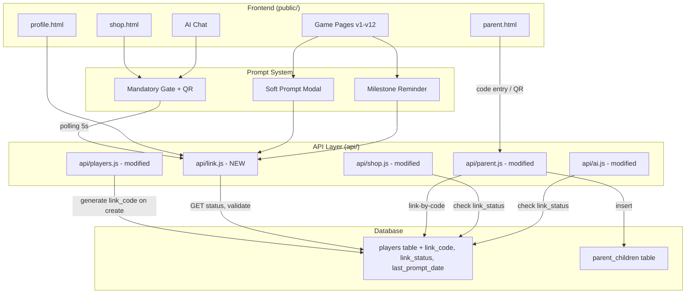
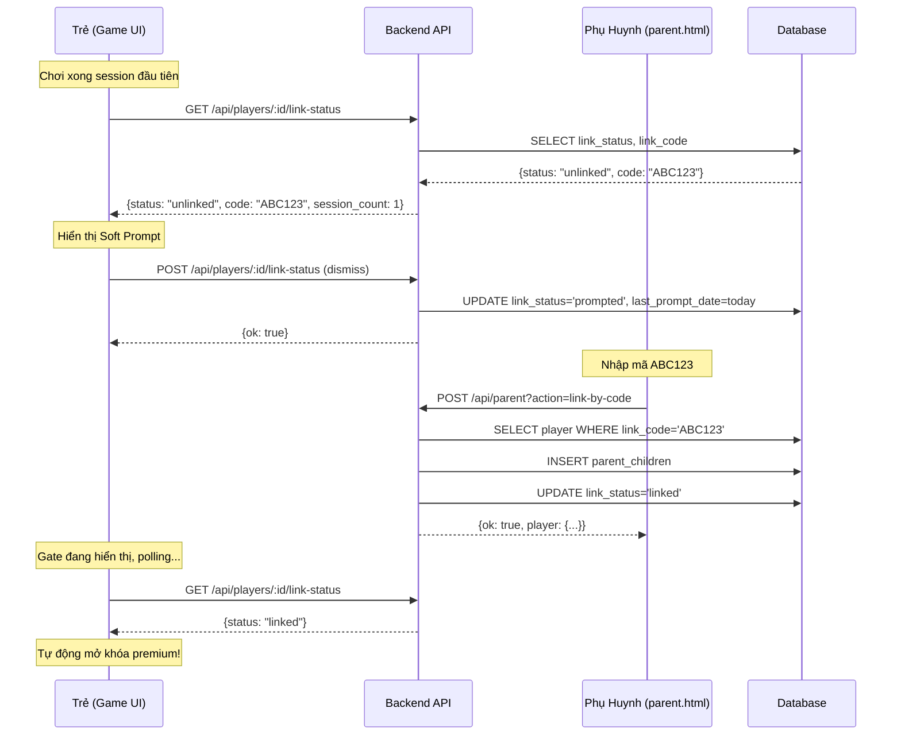

# Design: Progressive Parent Linking

## Overview

Progressive Parent Linking triển khai cơ chế liên kết phụ huynh theo từng bước cho Học Vui. Thay vì yêu cầu phụ huynh liên kết ngay từ đầu (gây friction cho trẻ), hệ thống cho phép trẻ chơi tự do và dần dần khuyến khích liên kết qua 3 giai đoạn:

1. **Soft Prompt** — Sau phiên đầu tiên, gợi ý nhẹ nhàng (có thể bỏ qua)
2. **Milestone Reminders** — Nhắc lại tại 5 sessions và 3-day streak
3. **Mandatory Gate** — Chặn Shop và AI Chat cho đến khi liên kết

Mỗi player được gán một mã liên kết 6 ký tự (uppercase alphanumeric) duy nhất ngay khi tạo tài khoản. Phụ huynh nhập mã này (hoặc quét QR) trên parent.html để liên kết.

### Key Design Decisions

1. **Link code sinh server-side**: Đảm bảo uniqueness qua retry loop với collision check trên DB.
2. **Trạng thái liên kết lưu trên players table**: Thêm cột `link_code`, `link_status`, `last_prompt_date` — tránh tạo bảng mới không cần thiết.
3. **Polling thay vì WebSocket cho link status**: Phù hợp Vercel serverless, đơn giản, interval 5s là đủ responsive.
4. **Rate limiting in-memory**: Dùng Map lưu IP + attempt count, reset mỗi 10 phút. Phù hợp single-process local dev và stateless serverless (mỗi cold start reset).
5. **Backend gate enforcement**: API Shop và AI Chat kiểm tra `link_status` để ngăn bypass từ frontend.
6. **Migration backward-compatible**: Script gán `link_code` + `link_status` cho players hiện tại dựa trên `parent_children` table.

## Architecture



### Flow Sequence: Parent Linking



## Components and Interfaces

### New API Endpoint: `api/link.js`

| Method | Endpoint | Description |
|--------|----------|-------------|
| GET | `/api/players/:id/link-status` | Trả về link_status, link_code, session_count, parent_names (nếu linked) |
| POST | `/api/players/:id/link-status` | Cập nhật trạng thái (dismiss prompt → `prompted`) |

### Modified: `api/parent.js`

| Method | Endpoint | Description |
|--------|----------|-------------|
| POST | `/api/parent?action=link-by-code` | **NEW** — Liên kết bằng mã code (thay vì tên) |

Body: `{ parent_id, link_code }`

Logic:
1. Validate format: 6 chars, uppercase alphanumeric
2. Rate limit check (5 attempts / 10 min / IP)
3. Lookup player by `link_code`
4. Insert `parent_children` record
5. Update player `link_status` = `linked`

### Modified: `api/players.js`

Khi tạo player mới (POST):
- Sinh `link_code` 6 ký tự unique
- Set `link_status` = `unlinked`

### Modified: `api/shop.js` & `api/ai.js`

Thêm check trước khi cho phép:
```javascript
// Kiểm tra link_status trước premium features
const player = await db.execute({ sql: `SELECT link_status FROM players WHERE id = ?`, args: [playerId] });
if (player.rows[0]?.link_status !== 'linked') {
  return res.status(403).json({ error: 'Cần liên kết phụ huynh để sử dụng tính năng này', require_link: true });
}
```

### Frontend Components

| Component | File | Description |
|-----------|------|-------------|
| Soft Prompt Modal | Embedded in game pages | Popup nhẹ sau session 1 |
| Milestone Reminder | Embedded in game pages | Popup tại milestones |
| Mandatory Gate | `public/link-gate.js` (shared) | Full-screen gate với QR + mã code |
| Profile Link Section | `public/profile.html` | Hiển thị mã + trạng thái |
| Parent Link Form | `public/parent.html` | Form nhập mã / QR scan |

### Link Code Generation

```javascript
const CHARSET = 'ABCDEFGHJKLMNPQRSTUVWXYZ23456789'; // No I/O/0/1 to avoid confusion

function generateLinkCode() {
  let code = '';
  for (let i = 0; i < 6; i++) {
    code += CHARSET[Math.floor(Math.random() * CHARSET.length)];
  }
  return code;
}

// Retry loop for uniqueness
async function generateUniqueLinkCode(db) {
  for (let attempt = 0; attempt < 10; attempt++) {
    const code = generateLinkCode();
    const existing = await db.execute({ sql: `SELECT id FROM players WHERE link_code = ?`, args: [code] });
    if (existing.rows.length === 0) return code;
  }
  throw new Error('Failed to generate unique link code after 10 attempts');
}
```

Character set (30 chars) loại bỏ I/O/0/1 tránh nhầm lẫn cho trẻ em. 30^6 = ~729 triệu combinations, đủ cho scale hiện tại.

### Prompt Trigger Logic (Frontend)

```javascript
async function checkAndShowPrompt(playerId) {
  const res = await fetch(`/api/players/${playerId}/link-status`);
  const data = await res.json();
  
  if (data.status === 'linked') return; // Đã liên kết, không cần prompt
  
  const today = new Date().toISOString().split('T')[0];
  if (data.last_prompt_date === today) return; // Đã nhắc hôm nay rồi
  
  if (data.status === 'unlinked' && data.session_count >= 1) {
    showSoftPrompt(data.code, 'Muốn ba mẹ xem thành tích không? 🌟');
  } else if (data.status === 'prompted') {
    if (data.session_count >= 5) {
      showSoftPrompt(data.code, 'Ba mẹ sẽ tự hào lắm đó! Liên kết ngay nhé 🏆');
    } else if (data.current_streak >= 3) {
      showSoftPrompt(data.code, 'Con giỏi quá! Cho ba mẹ biết nhé 🔥');
    }
  }
}
```

### Rate Limiting (In-Memory)

```javascript
const rateLimitMap = new Map(); // key: IP, value: { count, firstAttempt }
const RATE_LIMIT_WINDOW = 10 * 60 * 1000; // 10 minutes
const RATE_LIMIT_MAX = 5;

function checkRateLimit(ip) {
  const now = Date.now();
  const entry = rateLimitMap.get(ip);
  
  if (!entry || (now - entry.firstAttempt > RATE_LIMIT_WINDOW)) {
    rateLimitMap.set(ip, { count: 1, firstAttempt: now });
    return true; // allowed
  }
  
  if (entry.count >= RATE_LIMIT_MAX) return false; // blocked
  entry.count++;
  return true;
}
```

## Data Models

### Schema Changes: `players` Table

```sql
ALTER TABLE players ADD COLUMN link_code TEXT DEFAULT NULL;
ALTER TABLE players ADD COLUMN link_status TEXT DEFAULT 'unlinked' CHECK(link_status IN ('unlinked', 'prompted', 'linked'));
ALTER TABLE players ADD COLUMN last_prompt_date TEXT DEFAULT NULL;

CREATE UNIQUE INDEX IF NOT EXISTS idx_players_link_code ON players(link_code);
```

| Column | Type | Default | Description |
|--------|------|---------|-------------|
| `link_code` | TEXT | NULL | Mã 6 ký tự unique (sinh khi tạo player) |
| `link_status` | TEXT | 'unlinked' | Trạng thái: unlinked → prompted → linked |
| `last_prompt_date` | TEXT | NULL | Ngày cuối cùng hiển thị prompt (YYYY-MM-DD) |

### Migration Script for Existing Players

```javascript
async function migrateExistingPlayers(db) {
  // 1. Gán link_code cho players chưa có
  const players = await db.execute({ sql: `SELECT id FROM players WHERE link_code IS NULL`, args: [] });
  for (const player of players.rows) {
    const code = await generateUniqueLinkCode(db);
    await db.execute({ sql: `UPDATE players SET link_code = ? WHERE id = ?`, args: [code, player.id] });
  }
  
  // 2. Set link_status = 'linked' cho players đã có trong parent_children
  await db.execute({
    sql: `UPDATE players SET link_status = 'linked' WHERE id IN (SELECT DISTINCT player_id FROM parent_children)`,
    args: []
  });
  
  // 3. Set link_status = 'unlinked' cho players chưa link (default đã là unlinked)
  // Không cần action — default value đã đúng
}
```

### QR Code URL Format

```
https://{domain}/parent.html?code={LINK_CODE}
```

Frontend parent.html đọc `?code=` từ URL params và auto-fill vào form liên kết.

### API Response Shapes

**GET /api/players/:id/link-status**
```json
{
  "status": "unlinked|prompted|linked",
  "code": "ABC123",
  "session_count": 3,
  "current_streak": 2,
  "last_prompt_date": "2024-01-15",
  "parents": [] // or [{ id: 1, display_name: "Ba Minh" }] when linked
}
```

**POST /api/parent?action=link-by-code**
Request: `{ "parent_id": 1, "link_code": "ABC123" }`
Success: `{ "ok": true, "player": { "id": 5, "name": "Minh" } }`
Error: `{ "error": "Mã liên kết không hợp lệ" }`


## Correctness Properties

*A property is a characteristic or behavior that should hold true across all valid executions of a system — essentially, a formal statement about what the system should do. Properties serve as the bridge between human-readable specifications and machine-verifiable correctness guarantees.*

### Property 1: New player gets valid unique link code

*For any* valid player name and grade, creating a new player should produce a `link_code` that is exactly 6 characters long, contains only uppercase letters (excluding I, O) and digits (excluding 0, 1), and is unique across all players in the database. The `link_status` should be `unlinked`.

**Validates: Requirements 1.2, 2.1, 2.2**

### Property 2: Link code round-trip

*For any* player with a generated link_code, when an authenticated parent uses that code via `link-by-code`, the system should create a parent_children record linking that parent to that specific player, and the player's link_status should become `linked`.

**Validates: Requirements 2.3, 6.1**

### Property 3: Invalid codes are rejected

*For any* string that does not match the format `[A-HJ-NP-Z2-9]{6}` OR does not exist in the database, the link-by-code endpoint should return an error without creating any parent_children record or modifying any player's link_status.

**Validates: Requirements 2.4, 9.2**

### Property 4: Prompt trigger conditions

*For any* player with link_status = `unlinked` and session_count ≥ 1 and last_prompt_date ≠ today, the prompt decision function should return a prompt. *For any* player with link_status = `prompted` and (session_count ≥ 5 OR current_streak ≥ 3) and last_prompt_date ≠ today, the prompt decision function should return a milestone reminder.

**Validates: Requirements 3.1, 3.3, 4.1, 4.2**

### Property 5: Once-per-day prompt constraint

*For any* player where last_prompt_date equals today's date, the prompt decision function should return no prompt, regardless of session_count or streak values.

**Validates: Requirements 3.5, 4.4**

### Property 6: Premium gate enforcement

*For any* player with link_status ≠ `linked`, API calls to premium features (shop purchase, AI chat) should return HTTP 403 with `require_link: true` in the response body. No shop purchase should be processed and no AI response should be generated.

**Validates: Requirements 5.1, 5.2, 5.5**

### Property 7: Linking unlocks premium access

*For any* player whose link_status transitions from non-linked to `linked`, subsequent API calls to premium features (shop, AI) should succeed (assuming other validations pass like sufficient diamonds).

**Validates: Requirements 5.4**

### Property 8: Many-to-many linking

*For any* parent P and set of N distinct players (each with unique link_codes), P should be able to link to all N players successfully. *For any* player and set of M distinct parents, all M parents should be able to link to that player using the same link_code. The parent_children table should contain exactly the expected N (or M) records.

**Validates: Requirements 6.3, 6.4**

### Property 9: Rate limiting blocks after threshold

*For any* IP address that has made 5 failed link-by-code attempts within a 10-minute window, the next attempt from that IP should be rejected (HTTP 429) regardless of whether the provided code is valid.

**Validates: Requirements 9.3**

### Property 10: Migration assigns correct statuses and codes

*For any* set of existing players (some with parent_children records, some without), after running the migration: all players should have a non-null link_code matching the valid format, players with existing parent_children records should have link_status = `linked`, and players without should have link_status = `unlinked`. All link_codes should be unique.

**Validates: Requirements 10.1, 10.2, 10.3**

### Property 11: Basic gameplay unaffected by link status

*For any* player regardless of link_status (unlinked, prompted, or linked), API calls to basic game features (questions, sessions, answers, quests, streak) should succeed without any link-related restrictions.

**Validates: Requirements 1.3, 4.3**

### Property 12: Link status response includes parent info when linked

*For any* player with link_status = `linked`, the GET `/api/players/:id/link-status` endpoint should return a non-empty `parents` array containing the display_name of each linked parent. *For any* unlinked/prompted player, the `parents` array should be empty.

**Validates: Requirements 7.2**

### Property 13: Authentication required for linking

*For any* link-by-code request that does not include a valid `parent_id` (missing, null, or referencing a non-existent parent), the system should reject with an error and not modify any player's link_status.

**Validates: Requirements 9.1**

## Error Handling

### API Error Responses

| Scenario | Status | Error Message |
|----------|--------|---------------|
| Invalid code format (not 6 uppercase alphanum) | 400 | `Mã liên kết phải gồm 6 ký tự chữ và số` |
| Code not found in database | 404 | `Không tìm thấy mã liên kết này` |
| Already linked (same parent + player) | 409 | `Đã liên kết con này rồi` |
| Rate limited (too many failed attempts) | 429 | `Thử lại sau 30 phút` |
| Parent not authenticated | 401 | `Cần đăng nhập trước` |
| Premium access without link | 403 | `Cần liên kết phụ huynh để sử dụng tính năng này` |
| Player not found | 404 | `Không tìm thấy người chơi` |
| Missing required fields | 400 | `Thiếu thông tin bắt buộc` |
| Failed to generate unique code (extremely rare) | 500 | `Lỗi hệ thống, vui lòng thử lại` |

### Edge Cases

- **Player created before migration**: Migration script handles backfill of link_code and link_status
- **Parent links child who is already linked by another parent**: Allowed (many-to-many), link_status stays `linked`
- **Player already linked tries to access gate**: Should not see gate (status already `linked`)
- **Rate limit across serverless cold starts**: Rate limit resets on cold start (acceptable trade-off for serverless simplicity)
- **Same parent tries to link same child twice**: Returns 409 conflict (UNIQUE constraint on parent_children)
- **Link code collision during generation**: Retry loop (up to 10 attempts) ensures uniqueness
- **Session count = 0 (never played)**: No prompt shown, only shown after first completed session

### Transactional Safety

- **Link-by-code**: Parent_children INSERT + player link_status UPDATE must be atomic (use `db.batch()`)
- **Rate limit check**: Non-transactional (in-memory), acceptable for this use case
- **Migration**: Each player update is independent; partial migration is safe to re-run

## Testing Strategy

### Property-Based Testing

Library: **fast-check** (JavaScript property-based testing library, consistent with existing project specs)

Each correctness property will be implemented as a single property-based test with minimum 100 iterations. Tests tagged with:

```
// Feature: progressive-parent-linking, Property {N}: {title}
```

Key areas for property testing:
- `generateLinkCode()` — format validation (pure function)
- `generateUniqueLinkCode(db)` — uniqueness across generated batch
- `shouldShowPrompt(status, sessionCount, streak, lastPromptDate)` — prompt decision logic (pure function)
- `validateLinkCodeFormat(code)` — input validation (pure function)
- `checkRateLimit(ip)` — rate limit state machine
- Link-by-code API — round-trip property with mock DB
- Premium gate check — enforcement across all link_status values

### Unit Testing

Library: **vitest** (consistent with existing test files in the project)

Unit tests focus on:
- Specific example: create player "Minh" grade 2, verify link_code format
- Edge case: rate limit exactly at boundary (5th attempt passes, 6th fails)
- Edge case: rate limit resets after 10-minute window
- Integration: link-by-code creates parent_children record AND updates link_status atomically
- API contract: link-status endpoint returns correct shape for each status
- Migration: existing linked players get status `linked`, unlinked get `unlinked`
- Error scenarios: invalid format, non-existent code, duplicate link

### Test File Structure

```
tests/
  link-code-generation.property.test.js  — Properties 1, 3, 10
  link-flow.property.test.js             — Properties 2, 8, 12, 13
  prompt-logic.property.test.js          — Properties 4, 5
  premium-gate.property.test.js          — Properties 6, 7, 11
  rate-limit.property.test.js            — Property 9
  parent-linking.unit.test.js            — Unit tests for all edge cases
```

### Test Configuration

```javascript
// Property tests use fast-check with minimum 100 runs
fc.assert(fc.property(...), { numRuns: 100 });

// For rate limiting properties (state machine), use 200 runs
fc.assert(fc.property(...), { numRuns: 200 });
```

### Dual Testing Rationale

- **Property tests** verify universal correctness (code format always valid, gate always blocks unlinked, etc.)
- **Unit tests** verify specific scenarios (exact error messages, boundary conditions, integration flows)
- Both are complementary: property tests catch unexpected edge cases through randomization, unit tests document expected behavior explicitly
