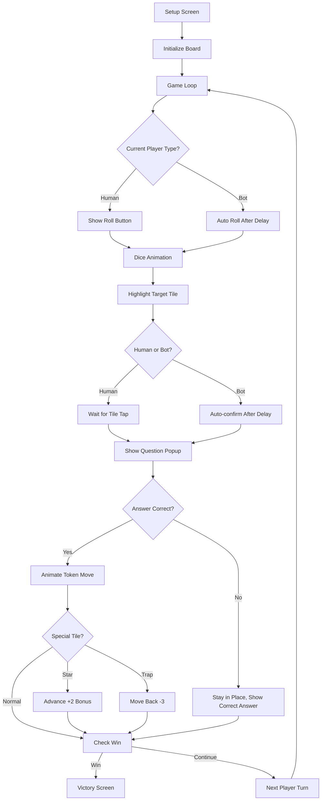

# Design Document: V5 Cờ Cá Ngựa

## Overview

V5 "Cờ Cá Ngựa" is a board game mode inspired by Vietnamese Ludo. Players (2-4, human or bot) roll dice, answer quiz questions to advance on a 36-tile circular board, and race to the finish. The game integrates with existing API endpoints for questions, sessions, answers, and progress tracking.

The implementation follows the established pattern: a self-contained HTML/JS/CSS bundle in `public/v5/` with no build step, vanilla JS, and Vietnamese UI. It reuses the platform's question API, player profile system (localStorage `hocvui_profile`), and session logging.

## Architecture

### File Structure

```
public/v5/
├── index.html    # Single page with all screens (setup, board, question popup, victory)
├── game.js       # Game engine: state machine, board logic, bot AI, API integration
└── style.css     # Board layout, animations, responsive design
```

### Server-Side Changes

- Add static route in `server.js`: `app.use('/v5', express.static(join(__dirname, 'public/v5')))`
- No new API endpoints needed — uses existing `/api/questions`, `/api/sessions`, `/api/answers`, `/api/players/:id/progress/v5`

### High-Level Flow



## Components and Interfaces

### 1. SetupManager

Handles the setup screen interactions.

```javascript
// Responsibilities:
// - Manage player slot configuration (2-4 players, human/bot)
// - Load player name from localStorage hocvui_profile
// - Collect subject/difficulty settings
// - Validate at least 1 human player
// - Emit "startGame" with config object

const setupConfig = {
  playerCount: 2,          // 2-4
  players: [
    { slot: 0, type: 'human', name: 'Tên', color: 'red' },
    { slot: 1, type: 'bot', name: 'Bot 1', color: 'blue' },
  ],
  subject: 'math',         // 'math' | 'vietnamese' | 'mix'
  difficulty: 'easy',      // 'easy' | 'medium' | 'hard'
};
```

### 2. BoardRenderer

Renders the 36-tile circular board using CSS grid/flexbox positioning.

```javascript
// Responsibilities:
// - Render 36 tiles in a loop layout (rectangular loop path, not literal circle)
// - Mark special tiles (4 star, 4 trap) with icons/colors
// - Position tokens on tiles with stacking when overlapping
// - Highlight target tile with pulsing animation
// - Animate token movement tile-by-tile

// Board layout: rectangular loop (like classic Ludo path)
// Top row: tiles 0-9 (left to right)
// Right column: tiles 10-17 (top to bottom)
// Bottom row: tiles 18-27 (right to left)
// Left column: tiles 28-35 (bottom to top)
// Tile 0 = Start, Tile 35 = last before finish
// Finish is a central/special position

const BOARD_CONFIG = {
  totalTiles: 36,
  starTiles: [4, 13, 22, 31],      // Evenly distributed
  trapTiles: [8, 17, 26, 35],      // Evenly distributed, not adjacent to stars
  layout: 'rectangular-loop',       // CSS grid approach
};
```

### 3. GameEngine (State Machine)

Core turn-based logic orchestrating the game flow.

```javascript
// Game states (turn flow state machine):
const STATES = {
  WAITING_ROLL: 'waiting_roll',         // Waiting for dice roll
  DICE_ROLLING: 'dice_rolling',         // Dice animation playing
  WAITING_TILE_TAP: 'waiting_tile_tap', // Target highlighted, waiting for tap
  SHOWING_QUESTION: 'showing_question', // Question popup displayed
  ANIMATING_MOVE: 'animating_move',     // Token moving animation
  SPECIAL_EFFECT: 'special_effect',     // Star/trap effect playing
  KICK_ANIMATION: 'kick_animation',     // Kicking opponent token back
  TURN_TRANSITION: 'turn_transition',   // Brief pause before next turn
  GAME_OVER: 'game_over',              // Winner declared
};

const gameState = {
  state: STATES.WAITING_ROLL,
  players: [],                // Array of { name, type, color, position, isFinished }
  currentPlayerIndex: 0,
  diceResult: [0, 0],
  targetTile: -1,
  questionsCache: [],
  usedQuestionIds: new Set(),
  totalTurns: 0,
  sessionId: null,
};
```

### 4. DiceManager

Handles dice rolling animation and random value generation.

```javascript
// Responsibilities:
// - Render two dice with tumbling CSS animation (1-2 seconds)
// - Generate uniform random values [1-6] for each die
// - Display final result and total
// - For bots: auto-trigger after 1s delay

function rollDice() {
  // Returns Promise<[die1, die2]>
  // Animation duration: random between 1000-2000ms
  // Uses Math.random() for each die independently
}
```

### 5. QuestionManager

Handles question fetching, caching, and no-repeat logic.

```javascript
// Responsibilities:
// - Pre-fetch 20 questions on game start
// - Refetch when cache drops below 5
// - Track used question IDs to prevent repeats
// - Retry once on network failure (2s delay)
// - Show error + return to setup on persistent failure

const questionCache = {
  questions: [],
  usedIds: new Set(),
  subject: 'math',
  difficulty: 'easy',
  loading: false,
};
```

### 6. BotPlayer

AI logic for bot opponents.

```javascript
// Responsibilities:
// - Auto-roll dice after 1s delay
// - Auto-confirm tile after 1s delay
// - Answer questions with accuracy based on difficulty:
//   easy: 60%, medium: 45%, hard: 30%
// - Display question on screen briefly (1.5s) before revealing answer
// - Add 1-2s delays between actions for natural feel

function botAnswer(question, difficulty) {
  const accuracy = { easy: 0.6, medium: 0.45, hard: 0.3 }[difficulty];
  const isCorrect = Math.random() < accuracy;
  if (isCorrect) return question.correct_answer;
  // Pick random wrong answer
  const options = ['a', 'b', 'c', 'd'].filter(o => o !== question.correct_answer);
  return options[Math.floor(Math.random() * options.length)];
}
```

### 7. AudioManager

Sound effects using Web Audio API (same pattern as V2/V4).

```javascript
// Sound types: dice_roll, correct, wrong, star_bonus, trap, kick, victory
// Uses oscillator-based synthesis (no external audio files)
```

### 8. AnimationManager

Coordinates visual effects.

```javascript
// Responsibilities:
// - Token tile-by-tile movement (CSS transitions on position)
// - Dice tumbling animation (CSS keyframes)
// - Target tile pulsing highlight
// - Star/trap effect particles
// - Kick animation (token flying back)
// - Victory confetti (particle system)
```

## Data Models

### Game State (in-memory)

```javascript
const game = {
  config: {
    playerCount: 2,
    subject: 'math',
    difficulty: 'easy',
  },
  players: [
    {
      slot: 0,
      name: 'Player Name',
      type: 'human',       // 'human' | 'bot'
      color: 'red',        // 'red' | 'blue' | 'green' | 'yellow'
      position: 0,         // 0 = start, 36 = finish
      stats: { correct: 0, incorrect: 0, turnsPlayed: 0 },
    },
  ],
  currentPlayerIndex: 0,
  state: 'waiting_roll',
  diceResult: null,
  targetTile: null,
  turnCount: 0,
  winner: null,
};
```

### Question Object (from API)

```javascript
// GET /api/questions?subject=math&difficulty=easy&limit=20
{
  id: 1,
  subject: 'math',
  difficulty: 'easy',
  question_text: '2 + 3 = ?',
  option_a: '4',
  option_b: '5',
  option_c: '6',
  option_d: '7',
  correct_answer: 'b',
}
```

### Session Save Payload

```javascript
// POST /api/sessions
{
  player_id: 1,
  subject: 'math',        // or 'vietnamese' or 'mixed'
  difficulty: 'easy',
  score: 36,              // tiles advanced (final position)
  total_questions: 12,
  correct_answers: 8,
  stars_earned: 0,        // not applicable for v5
  combo_max: 0,           // not applicable for v5
}
```

### Progress Save Payload

```javascript
// PUT /api/players/:id/progress/v5
{
  games_played: 5,
  total_correct: 40,
  total_questions: 60,
  wins: 3,
}
```

### Answer Log Payload

```javascript
// POST /api/answers
{
  session_id: 0,           // 0 during game, updated if session created
  player_id: 1,
  question_id: 42,
  selected_answer: 'b',
  correct_answer: 'b',
  is_correct: true,
  time_spent_ms: 3200,
}
```

### Board Layout Data

```javascript
// Tile position mapping for CSS grid rendering
// Board is a rectangular loop: 10 tiles per side
const TILE_POSITIONS = {
  // Top row (left to right): tiles 0-8
  // Right column (top to bottom): tiles 9-17
  // Bottom row (right to left): tiles 18-26
  // Left column (bottom to top): tiles 27-35
};

const SPECIAL_TILES = {
  stars: [4, 13, 22, 31],
  traps: [8, 17, 26, 35],
};
```


## Correctness Properties

*A property is a characteristic or behavior that should hold true across all valid executions of a system — essentially, a formal statement about what the system should do. Properties serve as the bridge between human-readable specifications and machine-verifiable correctness guarantees.*

### Property 1: Valid Game Initialization

*For any* valid game configuration (2-4 players with at least 1 human), when the game is initialized, all player tokens SHALL be at position 0, each player SHALL have a distinct color, and there SHALL be at least 1 human player.

**Validates: Requirements 1.3, 1.5, 1.6**

### Property 2: Valid Dice Output

*For any* dice roll, each individual die value SHALL be an integer in the range [1, 6], and the total move distance SHALL equal the sum of the two die values.

**Validates: Requirements 3.3, 3.4**

### Property 3: Target Tile Calculation

*For any* player at position P with dice total D, the calculated target tile SHALL equal min(P + D, FINISH_POSITION), where FINISH_POSITION is 36.

**Validates: Requirements 4.1, 4.6**

### Property 4: Correct Answer Advances Token

*For any* player at position P with target tile T, when the player answers correctly, the player's position SHALL update to T.

**Validates: Requirements 4.4**

### Property 5: Incorrect Answer Preserves Position

*For any* player at position P, when the player (human or bot) answers incorrectly, the player's position SHALL remain P.

**Validates: Requirements 4.5, 8.4**

### Property 6: Kick On Occupied Tile

*For any* game state where player A lands on a tile occupied by player B after a correct answer, player B's position SHALL be set to 0 (start).

**Validates: Requirements 4.9**

### Property 7: Special Tile Effects With Boundary Clamping

*For any* player landing on a Star_Tile at position P after a correct answer, the final position SHALL be min(P + 2, FINISH_POSITION). *For any* player landing on a Trap_Tile at position P after a correct answer, the final position SHALL be max(P - 3, 0).

**Validates: Requirements 5.1, 5.2, 5.3**

### Property 8: Turn Rotation Order

*For any* game with N players and current player index I, when the current player's turn ends and no winner is declared, the next active player SHALL be (I + 1) % N.

**Validates: Requirements 6.2**

### Property 9: Win Condition

*For any* game state where a player's position equals FINISH_POSITION (36), the game SHALL transition to game_over state with that player declared as winner.

**Validates: Requirements 7.1**

### Property 10: Question No-Repeat

*For any* sequence of questions served within a single Game_Session, no question ID SHALL appear more than once until all available questions in the cache have been used.

**Validates: Requirements 9.5**

### Property 11: Progress Accumulation

*For any* two consecutive game sessions for the same player, the cumulative progress values (games_played, total_correct, total_questions, wins) SHALL equal the previous values plus the new session's values.

**Validates: Requirements 10.2**

### Property 12: Board Layout Constraint

*For any* trap tile position in the board configuration, no adjacent tile (position ± 1) SHALL be a star tile.

**Validates: Requirements 2.3**

## Error Handling

### Network Errors

| Scenario | Handling |
|----------|----------|
| Question fetch fails | Retry once after 2s with loading indicator. On second failure, show error modal with "Về cài đặt" button |
| Session save fails | Silent retry once. Log to console. Game continues regardless |
| Progress save fails | Silent retry once. Save to localStorage as fallback for next session |
| Answer log fails | Silent failure. Non-blocking — game continues |

### Input Validation

| Scenario | Handling |
|----------|----------|
| No human player selected | Disable start button, show hint text |
| Player name empty | Use "Người chơi" as default name |
| localStorage unavailable | Proceed without profile, disable progress saving |
| Invalid dice result | Clamp to [1,6] range (defensive, shouldn't happen) |

### State Recovery

- If the browser tab is backgrounded during dice animation, resolve immediately on tab focus
- If a question popup is open and network drops, allow answering from cached question (answer logging deferred)
- No mid-game save/resume — games are short enough (~5-15 minutes) to complete in one sitting

## Testing Strategy

### Property-Based Testing

Library: **fast-check** (JavaScript property-based testing library)

Each correctness property from the design SHALL be implemented as a single property-based test with minimum 100 iterations. Tests will be tagged with comments referencing the property:

```javascript
// Feature: v5-co-ca-ngua, Property 3: Target Tile Calculation
fc.assert(fc.property(
  fc.integer({ min: 0, max: 35 }),  // current position
  fc.integer({ min: 2, max: 12 }),  // dice total
  (position, diceTotal) => {
    const target = calculateTargetTile(position, diceTotal);
    return target === Math.min(position + diceTotal, 36);
  }
), { numRuns: 100 });
```

Property tests focus on pure logic functions:
- `calculateTargetTile(position, diceTotal)`
- `applySpecialTileEffect(position, tileType)`
- `getNextPlayer(currentIndex, playerCount)`
- `initializeGame(config)`
- `rollDice()` — range validation
- `botAnswer(question, difficulty)` — accuracy within tolerance
- `serveNextQuestion(cache, usedIds)`
- `accumulateProgress(existing, newSession)`
- `checkKick(targetTile, allPlayerPositions, currentPlayerIndex)`
- `checkWinCondition(playerPositions)`

### Unit Testing

Library: **vitest** (fast, no-config test runner)

Unit tests cover specific examples and edge cases:
- Setup screen renders correct number of player slots
- Bot names are "Bot 1", "Bot 2", "Bot 3"
- Star tiles at positions [4, 13, 22, 31]
- Trap tiles at positions [8, 17, 26, 35]
- Question cache refetch triggers at threshold
- Network retry behavior
- Victory screen shows correct stats
- Progress accumulates (not overwrites)

### Test File Structure

```
tests/
├── v5-game-logic.test.js       # Property tests for game logic
├── v5-game-logic.unit.test.js  # Unit tests for specific cases
└── v5-bot.test.js              # Bot behavior tests
```

### Testing Configuration

- `fast-check` for property-based testing (minimum 100 runs per property)
- `vitest` as test runner with `--run` flag for single execution
- Game logic functions extracted into testable pure functions (no DOM dependency)
- DOM-dependent code tested manually
