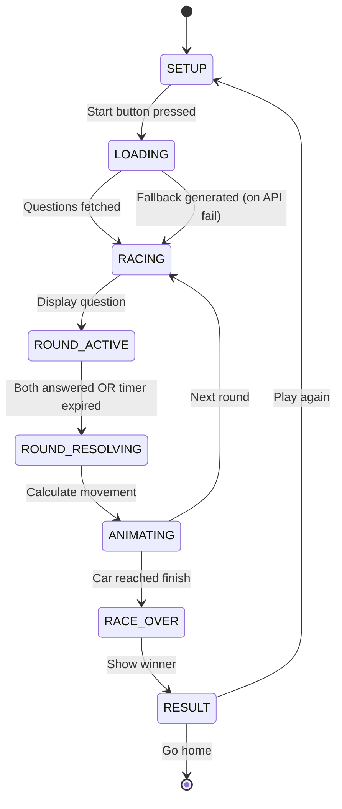

# Design Document: V6 Racing Game ("Đua Xe Trí Tuệ")

## Overview

V6 Racing Game is a 2-player local racing game where players compete by answering quiz questions correctly to advance their cars along a visual track. The first player to reach the finish line wins. This builds on the existing V3 Local Duel pattern (same-device, split-screen answer zones) but replaces the score-based system with a spatial racing metaphor.

The game is implemented as a self-contained HTML/JS/CSS bundle at `public/v6/` following the established pattern of V2-V5. No build step, no framework — vanilla JavaScript with CSS animations for the racing visuals.

**Key Design Decisions:**
- **CSS-based track rendering** over Canvas: simpler to implement, naturally responsive, accessible via DOM, and consistent with the app's existing approach (V5 uses CSS Grid for its board)
- **State machine architecture**: explicit game states prevent invalid transitions and simplify debugging
- **Split-screen touch zones**: Player 1 on left/top, Player 2 on right/bottom (mirrors V3's approach)
- **Horizontal scrolling track**: CSS flexbox lanes with `transform: translateX()` to scroll cars into view

## Architecture

### File Structure

```
public/v6/
├── index.html    # Game shell, all screens (setup/race/result), inline critical CSS
├── game.js       # Race engine: state machine, question flow, movement rules, audio
├── style.css     # Track rendering, animations, responsive layout
```

### Module Responsibilities

```mermaid
graph TD
    A[game.js - Race Engine] --> B[State Machine]
    A --> C[Question Manager]
    A --> D[Track Controller]
    A --> E[Input Handler]
    A --> F[Audio Engine]
    
    B --> |state transitions| D
    C --> |question data| B
    E --> |player answers| B
    D --> |DOM updates| G[Track Renderer - CSS]
    F --> |oscillator sounds| H[Web Audio API]
    
    I[/api/questions] --> |fetch| C
    J[localStorage] --> |profile| A
```

### Game State Machine



**States:**
| State | Description |
|-------|-------------|
| `SETUP` | Setup screen visible, players configure settings |
| `LOADING` | Fetching questions from API |
| `RACING` | Race in progress, preparing next question |
| `ROUND_ACTIVE` | Question displayed, timer counting down, awaiting answers |
| `ROUND_RESOLVING` | Both answered/timed out, calculating results |
| `ANIMATING` | Cars moving to new positions (CSS transition in progress) |
| `RACE_OVER` | A car crossed the finish line |
| `RESULT` | Result screen showing winner and stats |

## Components and Interfaces

### 1. Race Engine (main controller)

```javascript
// Core state object
const RaceState = {
  state: 'SETUP',              // Current game state
  settings: {
    p1Name: 'Xe Đỏ',
    p2Name: 'Xe Xanh',
    subject: 'mix',
    difficulty: 'medium',
    trackLength: 15,           // Number of tiles
  },
  track: {
    p1Position: 0,             // Current tile (0 to trackLength)
    p2Position: 0,
    obstacles: [],             // Array of tile indices with obstacles
    finishLine: 15,            // = trackLength
  },
  round: {
    number: 0,
    question: null,
    p1: { answered: false, answer: null, time: 0 },
    p2: { answered: false, answer: null, time: 0 },
    timerStart: 0,
    timerId: null,
  },
  questions: [],               // Fetched question pool
  questionIndex: 0,            // Current position in pool
  stats: {
    p1: { correct: 0, totalTime: 0, rounds: 0 },
    p2: { correct: 0, totalTime: 0, rounds: 0 },
  },
};
```

### 2. Question Manager

```javascript
// Interface for question fetching and management
const QuestionManager = {
  async fetchQuestions(subject, difficulty, limit) → Question[],
  generateFallback(count) → Question[],
  getNext() → Question | null,
  shufflePool() → void,
  hasMore() → boolean,
};

// Question shape (from API)
// { question_text, option_a, option_b, option_c, option_d, correct_answer, subject }
```

### 3. Track Controller

```javascript
// Interface for track rendering and animation
const TrackController = {
  initTrack(trackLength, obstacles) → void,
  moveCar(player, fromTile, toTile, options) → Promise<void>,
  showObstacleHit(player, tile) → void,
  showBoostEffect(player) → void,
  showCorrectEffect(player) → void,
  scrollToView(p1Pos, p2Pos) → void,
  showFinishAnimation(winner) → void,
};
```

### 4. Input Handler

```javascript
// Interface for player input (touch + keyboard)
const InputHandler = {
  bindAnswerButtons(p1Container, p2Container) → void,
  onAnswer(player, option) → void,   // callback
  lockPlayer(player) → void,
  unlockAll() → void,
};
```

### 5. Movement Calculator (pure function)

```javascript
/**
 * Calculate car movements for a round result.
 * @param {Object} roundResult - { p1Correct, p2Correct, p1Faster }
 * @param {Object} positions - { p1: number, p2: number }
 * @param {number[]} obstacles - tile indices with obstacles
 * @param {number} finishLine - finish tile index
 * @returns {{ p1NewPos, p2NewPos, p1Events[], p2Events[] }}
 */
function calculateMovement(roundResult, positions, obstacles, finishLine) → MovementResult;
```

**Movement Rules (from requirements):**
- Correct answer: +2 tiles
- Correct + faster than opponent: +3 tiles (2 base + 1 boost)
- Incorrect answer: +0 tiles
- Both incorrect: +1 tile each (anti-stall)
- Landing on obstacle: -1 tile (min 0)
- Reaching/exceeding finishLine: race ends

### 6. Audio Engine

```javascript
// Web Audio API oscillator sounds (same pattern as V3)
const AudioEngine = {
  playCorrect() → void,
  playWrong() → void,
  playBoost() → void,
  playObstacle() → void,
  playWin() → void,
  playStart() → void,
};
```

## Data Models

### Track Layout (DOM structure)

```html
<div class="race-track">
  <div class="lane lane-p1">
    <div class="car car-p1">🚗</div>
    <div class="tile" data-index="0"></div>
    <div class="tile" data-index="1"></div>
    <!-- ... tiles ... -->
    <div class="tile tile-finish" data-index="15">🏁</div>
  </div>
  <div class="lane lane-p2">
    <div class="car car-p2">🚙</div>
    <div class="tile" data-index="0"></div>
    <!-- ... -->
  </div>
</div>
```

### Obstacle Placement Algorithm

```javascript
function generateObstacles(trackLength) {
  const count = Math.max(2, Math.min(5, Math.floor(trackLength * 0.2)));
  const eligible = []; // tiles 2 through trackLength-1 (exclude first 2 and finish)
  for (let i = 2; i < trackLength; i++) eligible.push(i);
  shuffle(eligible);
  return eligible.slice(0, count).sort((a, b) => a - b);
}
```

### Timer Configuration

- Duration: 15 seconds per round (fixed, unlike V3's variable speed)
- Visual: progress bar that depletes from 100% to 0%
- Color coding: green (>50%), orange (20-50%), red (<20%)
- Resolution: 100ms interval (smooth visual countdown)

### Screen Layout Data

```
Setup Screen:
  - P1 name input (auto-filled from profile)
  - P2 name input
  - Subject selector (Toán / Tiếng Việt / Trộn)
  - Difficulty selector (Dễ / Vừa / Khó)
  - Track length selector (Ngắn 10 / Vừa 15 / Dài 20)
  - Start button

Race Screen:
  - Track area (top/center): 2 horizontal lanes with cars and tiles
  - Timer bar (below track)
  - Question text (center)
  - P1 answer zone (left on wide / top on narrow)
  - P2 answer zone (right on wide / bottom on narrow)

Result Screen:
  - Winner declaration with trophy
  - Stats table (rounds, correct, avg time)
  - Play Again button
  - Home button
```


## Correctness Properties

*A property is a characteristic or behavior that should hold true across all valid executions of a system — essentially, a formal statement about what the system should do. Properties serve as the bridge between human-readable specifications and machine-verifiable correctness guarantees.*

### Property 1: Movement calculation follows defined rules

*For any* round result where P1 and P2 each either answer correctly or incorrectly with varying response times, the `calculateMovement` function SHALL:
- Award +2 tiles to a player who answers correctly
- Award +3 tiles (2 base + 1 boost) to a player who answers correctly AND faster than the opponent
- Award +0 tiles to a player who answers incorrectly (when the other player is correct)
- Award +1 tile to both players when both answer incorrectly

**Validates: Requirements 4.1, 4.2, 4.3, 4.4**

### Property 2: Obstacle penalty with floor at zero

*For any* car position and any obstacle tile the car lands on, the obstacle penalty SHALL reduce the position by 1 tile, and the resulting position SHALL never be less than 0.

**Validates: Requirements 5.3**

### Property 3: Obstacle generation produces valid placements

*For any* valid track length (10, 15, or 20), the generated obstacle array SHALL contain between 2 and 5 obstacles (inclusive), and every obstacle position SHALL be >= 2 and < trackLength (excluding the first 2 tiles and the finish line tile).

**Validates: Requirements 5.1, 5.4**

### Property 4: Win detection triggers at finish line

*For any* car position that equals or exceeds the finish line tile index, the race engine SHALL declare that player as the winner and transition to the RACE_OVER state.

**Validates: Requirements 6.1**

### Property 5: Tie-breaking by response speed

*For any* round where both players' cars reach or exceed the finish line, the player with the lower response time SHALL be declared the winner.

**Validates: Requirements 6.2**

### Property 6: Fallback question generation produces valid math questions

*For any* requested count N, the fallback generator SHALL produce exactly N questions where each question's `correct_answer` key maps to the option containing the actual arithmetic result of the displayed operation.

**Validates: Requirements 7.2**

### Property 7: Shuffle preserves all elements

*For any* array of questions, shuffling SHALL produce an array of the same length containing exactly the same elements (a permutation of the original).

**Validates: Requirements 7.4**

### Property 8: Race statistics accurately reflect round history

*For any* sequence of round results, the computed statistics SHALL report the correct total rounds played, correct answer count per player, and average response time per player (total time / rounds answered).

**Validates: Requirements 6.4**

## Error Handling

### API Failure

| Scenario | Handling |
|----------|----------|
| `/api/questions` returns error/timeout | Generate fallback math questions locally (addition/subtraction within 100) |
| Questions pool exhausted mid-race | Attempt to fetch more; if fails, generate fallback batch |
| Network drops during race | No impact — all game logic is client-side after initial fetch |

### Input Validation

| Scenario | Handling |
|----------|----------|
| Empty player name | Use defaults ("Xe Đỏ" / "Xe Xanh") |
| No profile in localStorage | Redirect to home page (`/`) for profile creation |
| Invalid localStorage data | Clear corrupted data, redirect to home |

### Audio Failures

Web Audio API may fail on first load (requires user gesture). The AudioContext is created lazily on first user interaction (tap the Start button). All `playSound` calls are wrapped in try/catch — audio failure never blocks gameplay.

### Edge Cases

| Case | Handling |
|------|----------|
| Car position goes negative after obstacle | Clamp to 0 |
| Both cars finish same round, same time | P1 wins (first player tiebreaker) |
| Player taps answer after timer expired | Ignore (roundActive flag is false) |
| Browser tab loses focus during timer | Timer continues; no pause mechanism |

## Testing Strategy

### Unit Tests (example-based)

Focus on specific scenarios and edge cases:
- Setup screen renders correct defaults and options
- Timer expiry treats unanswered players as incorrect
- Visual effects trigger on correct/boost/obstacle events
- Responsive layout breakpoints at 500px
- Profile-based redirect logic

### Property-Based Tests

**Library:** [fast-check](https://github.com/dubzzz/fast-check) (JavaScript PBT library)

**Configuration:** Minimum 100 iterations per property test.

Each property test references its design property:

```javascript
// Tag format: Feature: v6-racing-game, Property N: <title>
```

Properties to implement:
1. **Movement calculation** — Generate random (p1Correct, p2Correct, p1Time, p2Time) tuples, verify movement output matches rules
2. **Obstacle penalty** — Generate random positions (0..trackLength) and obstacles, verify penalty logic
3. **Obstacle generation** — Generate random track lengths from {10, 15, 20}, verify bounds and count
4. **Win detection** — Generate positions near finish, verify race-end trigger
5. **Tie-breaking** — Generate same-round finishes with different times
6. **Fallback generation** — Generate random count (1..50), verify all questions are valid
7. **Shuffle invariant** — Generate random arrays, verify permutation property
8. **Stats calculation** — Generate random round histories, verify aggregation

### Integration Tests

- API fetch with correct parameters (mock fetch)
- Question pool replenishment when exhausted
- Full game flow: setup → race → result → play again

### Test File Location

```
tests/v6-game-logic.test.js        # Unit + property tests for pure logic
tests/v6-game-logic.unit.test.js   # Example-based edge case tests
```

### Rendering Approach (CSS-based Track)

The track uses CSS flexbox for lane layout with positioned car elements:

```css
.race-track {
  display: flex;
  flex-direction: column;
  gap: 8px;
  overflow: hidden;          /* Hide overflow, we translate */
  position: relative;
}

.lane {
  display: flex;
  position: relative;
  height: 50px;
  align-items: center;
}

.tile {
  width: 40px;
  height: 40px;
  flex-shrink: 0;
  /* ... */
}

.car {
  position: absolute;
  left: 0;
  transition: transform 0.6s cubic-bezier(0.34, 1.56, 0.64, 1); /* bouncy ease */
  font-size: 1.8rem;
  z-index: 10;
}
```

Car position is controlled via `transform: translateX(tileIndex * tileWidth)`. The track container scrolls via a wrapper `translateX` to keep cars in view.

### Responsive Strategy

```css
/* Mobile (< 500px): vertical track, stacked answer zones */
@media (max-width: 500px) {
  .race-track { flex-direction: row; }         /* Vertical lanes */
  .lane { flex-direction: column; width: 50px; height: auto; }
  .answer-zones { flex-direction: column; }     /* P1 above P2 */
}

/* Wide (>= 500px): horizontal track, side-by-side answers */
@media (min-width: 500px) {
  .race-track { flex-direction: column; }       /* Horizontal lanes */
  .lane { flex-direction: row; }
  .answer-zones { flex-direction: row; }        /* P1 left, P2 right */
}
```

### Animation Approach

All animations use CSS with class toggling:

| Animation | Technique | Duration |
|-----------|-----------|----------|
| Car movement | `transform: translateX()` with transition | 600ms |
| Obstacle hit | `@keyframes shake` + car bounce back | 400ms |
| Boost effect | `@keyframes speedLines` (pseudo-elements) | 500ms |
| Star burst (correct) | `@keyframes starBurst` (scale + fade) | 400ms |
| Celebration (win) | `@keyframes confetti` (positioned spans) | 2500ms |
| Timer depletion | `width` transition (linear) | 15s |

No `requestAnimationFrame` loops — everything is declarative CSS, triggered by adding/removing classes from JavaScript. This keeps the rendering approach simple and performant.
